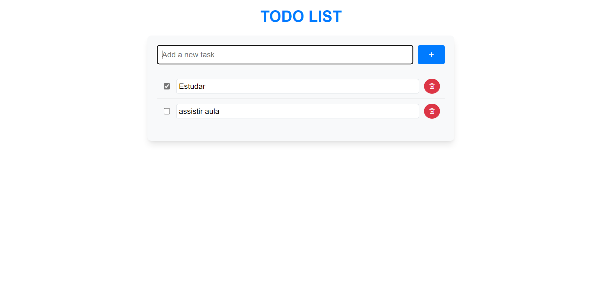

# Todo App

Este é um projeto simples de uma aplicação de lista de afazeres (Todo App) utilizando Flask no backend e Vue.js no frontend. A aplicação permite que o usuário adicione, edite, marque como concluído e exclua afazeres. O projeto foi desenvolvido para demonstrar a integração entre um backend em Flask e um frontend em Vue.js, utilizando axios para as requisições HTTP.

## Funcionalidades

- **Adicionar afazeres**: Adicione novas tarefas à lista.
- **Listar afazeres**: Veja todos os afazeres cadastrados.
- **Atualizar afazeres**: Edite o título ou o status (concluído/não concluído) de um afazer específico.
- **Deletar afazeres**: Remova um afazer da lista.

## Tecnologias Utilizadas

- **Backend**: [Flask](https://flask.palletsprojects.com/)
- **Frontend**: [Vue.js](https://vuejs.org/)
- **Banco de dados**: Em memória (para fins de simplicidade e demonstração)
- **Requisições HTTP**: [axios](https://axios-http.com/)

## Estrutura do Projeto

### Backend (Flask)

O backend é responsável por gerenciar os afazeres e fornece uma API REST simples para operações CRUD. Os endpoints disponíveis são:

- `GET /api/todos`: Retorna todos os afazeres cadastrados.
- `POST /api/todos`: Adiciona um novo afazer.
- `PUT /api/todos/<int:todo_id>`: Atualiza o título ou o status de um afazer específico.
- `DELETE /api/todos/<int:todo_id>`: Deleta um afazer específico.

### Frontend (Vue.js)

O frontend é responsável pela interface da aplicação, permitindo que o usuário interaja com a lista de afazeres. Utiliza o axios para fazer requisições ao backend Flask.

- **`fetchTodos`**: Faz uma requisição para carregar os afazeres na inicialização.
- **`addTodo`**: Adiciona um novo afazer enviando um `POST` ao backend.
- **`updateTodo`**: Atualiza um afazer específico enviando um `PUT`.
- **`deleteTodo`**: Remove um afazer enviando um `DELETE`.

